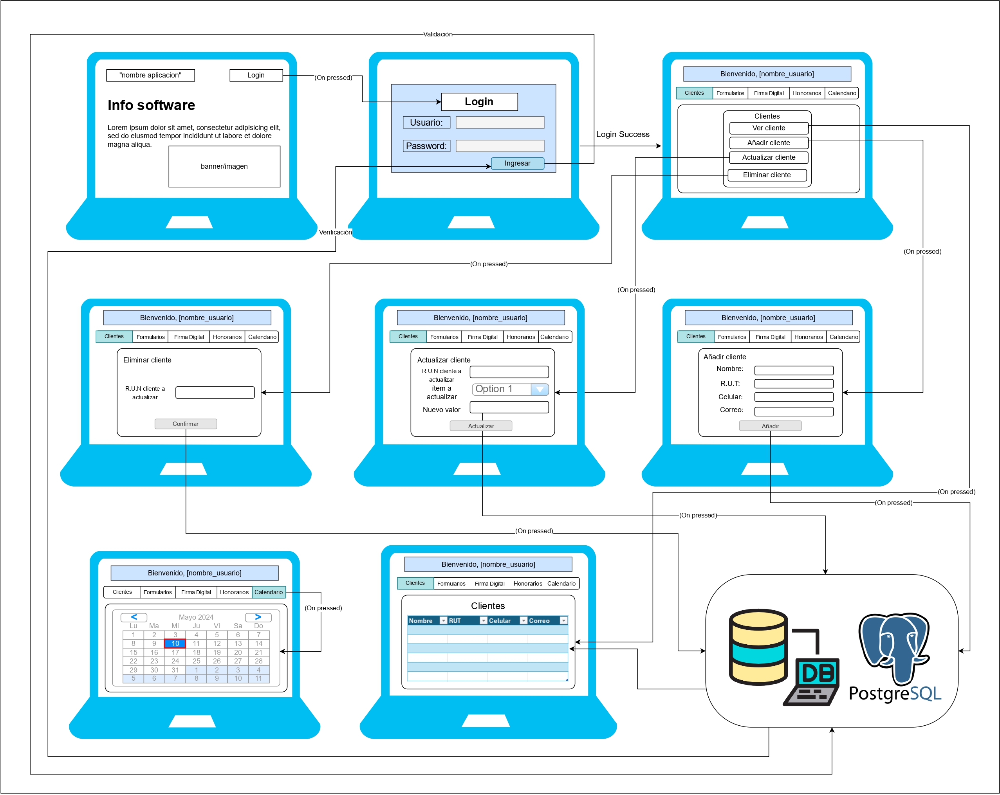

# F29-Los-amigos-del-SII

En el siguiente repositorio encontrará el proyecto llevado a cabo para la asignatura TEL335 - Disseño de Aplicaciones Web y Móviles

# Integrantes

* Cristóbal Moraga Guerrero - 202130008-2
* Vicente Tejos Medel
* Javier Cáceres León

# Problemática a resolver

La complejidad y las dificultades asociadas con el cumplimiento de los plazos y requisitos fiscales establecidos por el SII, así como la gestión contable relacionada con dichos procesos.

1. Complejidad y tiempo de gestión.

2. Falta de notificaciones y recordatorios.

3. Control de documentos fiscales.

4. Cumplimiento de la normativa de facturación electrónica.

5. Dificultades de la gestión contable.

# Propuesta de solución

El software propuesto busca automatizar y simplificar estos procesos, proporcionando notificaciones, recordatorios y herramientas para el control eficiente de los documentos fiscales y el cumplimiento de la normativa vigente.

# Bosquejo de pantallas

